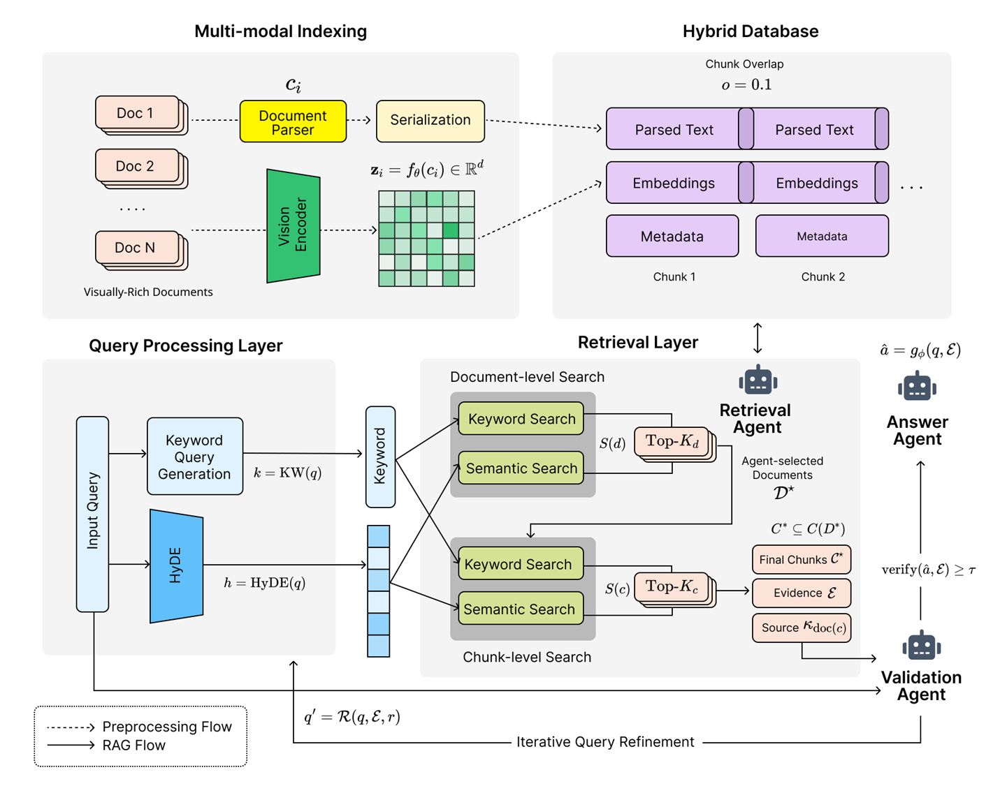

# VLD-RAG

`VLD-RAG` is a research codebase for visually rich long-document retrieval workflows.



At the moment, this repository exposes reusable building blocks rather than a full end-to-end public product. The current codebase is centered on:

- page parsing for visually rich documents
- sparse and dense retrieval components
- PostgreSQL/Peewee database entities for documents, pages, chunks, and embeddings
- retrieval evaluation metrics

## Current Scope

The repository currently includes:

- `parser/` for page parsing and normalized parser outputs
- `retriever/` for BM25 retrieval, ColPali-based retrieval, vector loading, and scoring
- `database/` for the active ORM schema and pgvector field support
- `llm/` for lightweight wrappers around multimodal LLMs
- `eval/` for retrieval metrics
- `configs/` for portable path and model configuration examples

What it does not currently provide as a polished public interface:

- a packaged Python distribution
- a complete end-to-end benchmark reproduction pipeline
- a single documented CLI or application entrypoint

## Repository Layout

```text
VLD-RAG/
├── configs/
│   ├── data.yml
│   └── model.yml
├── database/
│   ├── README.md
│   ├── entities.py
│   ├── vector_field.py
│   └── __init__.py
├── eval/
│   ├── retrieval_metrics.py
│   └── __init__.py
├── llm/
│   ├── base.py
│   ├── internvl3_5_4b.py
│   ├── qwen3_vl_4b_instruct.py
│   └── __init__.py
├── parser/
│   ├── engines/
│   │   ├── paddle_ocr.py
│   │   └── __init__.py
│   ├── base.py
│   ├── schema.py
│   └── __init__.py
├── retriever/
│   ├── bm25_retriever.py
│   ├── colpali_vision_retriever.py
│   ├── db_context.py
│   ├── scorer.py
│   ├── vector_loader.py
│   └── __init__.py
└── README.md
```

## Main Components

### Parser

`parser/engines/paddle_ocr.py` provides `PaddleOCRParser`, which turns a page image into normalized parser output using the shared schema from `parser/schema.py`.

Current parser-facing data structures:

- `PageParse`
- `Block`
- `BBox`
- `RAGElement`

### Retriever

`retriever/` contains the main retrieval-side components:

- `BM25Retriever` for sparse text retrieval
- `ColPaliVisionRetriever` for dense vision-oriented retrieval
- `VectorLoader` for loading embeddings from database rows or local artifacts
- `EmbeddingScorer` for vector similarity scoring
- `RetrieverDbContext` for binding the retriever stack to the current database schema

### Database

The active schema is defined in `database/entities.py` using Peewee models.

Main tables:

- `tb_runs`
- `tb_documents`
- `tb_pages`
- `tb_chunks`
- `tb_embeddings`

The schema overview and Mermaid ERD are documented in `database/README.md`.

### LLM Wrappers

`llm/` currently provides:

- `Qwen3VL4BInstruct`
- `InternVL35_4B`

These wrappers accept either a local model path or a Hugging Face model ID.

### Evaluation

`eval/retrieval_metrics.py` provides standard retrieval metrics including:

- Recall@K
- MRR@K
- nDCG@K
- top-k accuracy
- batch metric aggregation

## Configuration

This repository currently includes two portable config examples:

- `configs/data.yml`
- `configs/model.yml`

`configs/data.yml` defines relative paths for datasets, artifacts, outputs, and results.

`configs/model.yml` defines a small model registry for:

- BM25 retrieval
- ColPali retrieval
- multimodal LLM wrappers
- runtime cache settings

These config files use repository-relative paths so they are easier to move across machines.

## Installation

There is no `pyproject.toml` yet, so setup is currently manual.

Minimum recommended environment:

- Python 3.10+
- `numpy`
- `Pillow`
- `peewee`
- `psycopg2` or `psycopg2-binary`
- `python-dotenv`
- `PyYAML`
- `rank-bm25`

Optional dependencies by feature:

- `paddleocr` and `paddlepaddle` for `PaddleOCRParser`
- `transformers` and `torch` for the LLM wrappers and ColPali retriever
- `pgvector` for PostgreSQL vector support
- `pytz` for timestamp helpers in the ORM models

Example:

```bash
python -m venv .venv
.venv\Scripts\activate
python -m pip install --upgrade pip
pip install numpy Pillow peewee psycopg2-binary python-dotenv PyYAML rank-bm25 pytz
```

Add the feature-specific packages you need on top of that base environment.

## Quick Usage

### BM25 Retrieval

```python
from retriever import BM25Retriever

corpus = [
    {"id": "chunk_001", "text": "Revenue increased in Q4 due to stronger enterprise demand."},
    {"id": "chunk_002", "text": "The chart shows year-over-year margin improvement."},
]

retriever = BM25Retriever(corpus=corpus)
results = retriever.retrieve("enterprise revenue", top_k=2)
print(results)
```

### Retrieval Metrics

```python
from eval import calculate_all_metrics

rankings = {
    "q1": ["doc3", "doc1", "doc2"],
    "q2": ["doc2", "doc4", "doc5"],
}

ground_truth = {
    "q1": ["doc1"],
    "q2": ["doc2", "doc5"],
}

metrics = calculate_all_metrics(
    rankings=rankings,
    ground_truth=ground_truth,
    k_values=[1, 3, 5],
    mrr_k_values=[10],
    ndcg_k_values=[3, 5],
)

print(metrics)
```

### Page Parsing

```python
from PIL import Image
from parser.engines import PaddleOCRParser

image = Image.open("page.png")

parser = PaddleOCRParser(device="cpu")
parser.initialize()

page_parse = parser.parse_page(
    doc_id="sample-doc",
    page_no=0,
    image=image,
    image_path="page.png",
)

print(page_parse.to_dict())
```

## Database Notes

The retriever/database path is currently aligned to the `TB*` schema in `database/entities.py`.

In particular, embedding loading is centered on:

- `TBEmbedding`
- `TBChunk`
- `TBPage`
- `TBDocument`

The embedding model supports:

- `single_vector` mode
- `multi_vector` mode
- optional pooled vectors via `pooled_embedding_vector`
- artifact-backed vectors via `embedding_path` and `storage_path`

## Status

This repository is still evolving, but the current README is intended to describe the code that exists today rather than a larger future system.
