# Database Schema and ERD

This document describes the database schema used for `VLD-RAG`.

The actual schema definition for this repository currently lives in the Peewee ORM models in `database/entities.py`.

## Source of Truth

The schema for this project is defined in:

- `database/entities.py`
- `database/vector_field.py`

Core characteristics:

- Database engine: PostgreSQL-compatible database
- ORM: Peewee
- JSON fields: `BinaryJSONField` (`jsonb`)
- Vector field: custom `VectorField` backed by `pgvector`
- Main use case:
  - document/page/chunk management
  - embedding metadata and vector storage
  - experiment/run tracking

## Schema Summary

The current schema is organized into five main tables:

1. `tb_runs`
2. `tb_documents`
3. `tb_pages`
4. `tb_chunks`
5. `tb_embeddings`

### 1. `tb_runs`

Stores run metadata for experiments and ingestion/indexing sessions.

| Column | Type | Notes |
| --- | --- | --- |
| `run_id` | `varchar(255)` | Primary key |
| `run_name` | `varchar(500)` | Optional human-readable name |
| `note` | `text` | Optional description |
| `created_by` | `varchar(255)` | Optional creator |
| `is_active` | `boolean` | Defaults to `true` |
| `source_repo` | `varchar(255)` | Optional repository/source tag |
| `metadata` | `jsonb` | Optional structured metadata |
| `run_info` | `jsonb` | Optional run configuration/details |
| `created_at` | `timestamp` | Creation time |
| `updated_at` | `timestamp` | Update time |

Indexes:

- unique: `run_id`
- index: `source_repo`

### 2. `tb_documents`

Stores document-level metadata.

| Column | Type | Notes |
| --- | --- | --- |
| `doc_id` | `varchar(255)` | Primary key |
| `doc_name` | `varchar(500)` | Required document name |
| `doc_type` | `varchar(50)` | Optional type such as pdf/image/etc. |
| `source_path` | `text` | Original source location |
| `data_source` | `varchar(255)` | Dataset or corpus name |
| `data_source_path` | `text` | Optional dataset path |
| `source_repo` | `varchar(255)` | Origin repository |
| `total_pages` | `integer` | Optional page count |
| `total_chunks` | `integer` | Optional chunk count |
| `created_at` | `timestamp` | Creation time |
| `updated_at` | `timestamp` | Update time |
| `metadata` | `jsonb` | Optional document metadata |

Indexes:

- unique: `doc_id`
- index: `data_source`
- index: `source_repo`

### 3. `tb_pages`

Stores page-level data for each document.

| Column | Type | Notes |
| --- | --- | --- |
| `page_id` | `varchar(255)` | Primary key |
| `doc_id` | `varchar(255)` | Foreign key to `tb_documents.doc_id` |
| `page_number` | `integer` | Required page order within a document |
| `image_path` | `text` | Required rendered page image path |
| `image_width` | `integer` | Optional width |
| `image_height` | `integer` | Optional height |
| `ocr_text` | `text` | Optional OCR output |
| `markdown_text` | `text` | Optional parsed markdown |
| `parser_engine` | `varchar(50)` | Parser name |
| `parser_version` | `varchar(50)` | Parser version |
| `parsed_at` | `timestamp` | Parsing completion time |
| `created_at` | `timestamp` | Creation time |

Constraints and indexes:

- primary key: `page_id`
- unique: (`doc_id`, `page_number`)
- foreign key: `doc_id -> tb_documents.doc_id` with `ON DELETE CASCADE`
- index: `parser_engine`

### 4. `tb_chunks`

Stores chunk-level regions extracted from pages.

This is the main retrieval unit for embeddings and search.

| Column | Type | Notes |
| --- | --- | --- |
| `chunk_id` | `varchar(255)` | Primary key |
| `doc_id` | `varchar(255)` | Foreign key to `tb_documents.doc_id` |
| `page_id` | `varchar(255)` | Foreign key to `tb_pages.page_id` |
| `source_key` | `jsonb` | Optional source locator payload |
| `chunk_index` | `integer` | Required chunk order within a page |
| `bbox_x1` | `integer` | Bounding box left |
| `bbox_y1` | `integer` | Bounding box top |
| `bbox_x2` | `integer` | Bounding box right |
| `bbox_y2` | `integer` | Bounding box bottom |
| `crop_image_path` | `text` | Required crop image path |
| `crop_width` | `integer` | Optional crop width |
| `crop_height` | `integer` | Optional crop height |
| `chunk_type` | `varchar(50)` | Optional region type |
| `ocr_text` | `text` | Optional OCR text |
| `markdown_text` | `text` | Optional normalized/parsed text |
| `parser_engine` | `varchar(50)` | Parser used for this chunk |
| `block_id` | `varchar(255)` | Optional upstream parser block id |
| `status` | `varchar(50)` | Processing state |
| `qdrant_collection_name` | `varchar(255)` | Optional external vector index collection |
| `created_at` | `timestamp` | Defaults to KST-based current time |

Supported `status` values in the model:

- `created`
- `parsing`
- `parsed`
- `encoding`
- `encoded`
- `indexed`
- `failed`

Constraints and indexes:

- primary key: `chunk_id`
- unique: (`page_id`, `chunk_index`)
- foreign key: `doc_id -> tb_documents.doc_id` with `ON DELETE CASCADE`
- foreign key: `page_id -> tb_pages.page_id` with `ON DELETE CASCADE`
- index: `chunk_type`
- index: `doc_id`
- index: `status`
- index: `qdrant_collection_name`

### 5. `tb_embeddings`

Stores embedding metadata for chunks.

This table is designed as a unified embedding registry so different vision encoders and storage modes can be tracked in one place.

| Column | Type | Notes |
| --- | --- | --- |
| `embedding_id` | `varchar(255)` | Primary key |
| `chunk_id` | `varchar(255)` | Foreign key to `tb_chunks.chunk_id` |
| `run_id` | `varchar(255)` | Optional run identifier, not declared as FK in current model |
| `vision_encoder` | `varchar(100)` | Required encoder name such as `siglip`, `colpali`, `omniembed` |
| `model_version` | `varchar(100)` | Required model version |
| `text_encoder` | `varchar(100)` | Optional paired text encoder |
| `embedding_mode` | `varchar(50)` | Required, usually `single_vector` or `multi_vector` |
| `embedding_dim` | `integer` | Single-vector dimension |
| `num_vectors` | `integer` | Multi-vector token count |
| `vector_dim` | `integer` | Per-vector dimension for multi-vector storage |
| `embedding_path` | `text` | Single-vector file path |
| `storage_path` | `text` | Multi-vector file path |
| `storage_format` | `varchar(50)` | Storage format metadata |
| `file_size_bytes` | `bigint` | Serialized file size |
| `faiss_id` | `integer` | Unique external Faiss id |
| `qdrant_collection_name` | `varchar(255)` | Optional external Qdrant collection |
| `source_repo` | `varchar(255)` | Source repository tag |
| `data_source` | `varchar(255)` | Dataset/corpus tag |
| `doc_id` | `varchar(255)` | Denormalized document id for query convenience |
| `pooled_embedding_vector` | `vector` | Optional pgvector column |
| `created_at` | `timestamp` | Defaults to KST-based current time |
| `updated_at` | `timestamp` | Defaults to KST-based current time |

Constraints and indexes:

- primary key: `embedding_id`
- unique: (`chunk_id`, `vision_encoder`)
- unique: `faiss_id`
- foreign key: `chunk_id -> tb_chunks.chunk_id` with `ON DELETE CASCADE`
- index: `vision_encoder`
- index: `embedding_mode`
- index: `model_version`
- index: `qdrant_collection_name`
- index: `source_repo`
- index: `data_source`
- index: `doc_id`

## Relationship Overview

The relational flow is:

- one `tb_documents` row can have many `tb_pages`
- one `tb_documents` row can have many `tb_chunks`
- one `tb_pages` row can have many `tb_chunks`
- one `tb_chunks` row can have many `tb_embeddings`
- `tb_embeddings.run_id` is stored as metadata, but is not currently enforced as a foreign key to `tb_runs`

## Mermaid ERD

```mermaid
erDiagram
    tb_runs {
        string run_id PK
        string run_name
        text note
        string created_by
        bool is_active
        string source_repo
        text metadata
        text run_info
        date created_at
        date updated_at
    }

    tb_documents {
        string doc_id PK
        string doc_name
        string doc_type
        text source_path
        string data_source
        text data_source_path
        string source_repo
        int total_pages
        int total_chunks
        date created_at
        date updated_at
        text metadata
    }

    tb_pages {
        string page_id PK
        string doc_id FK
        int page_number
        text image_path
        int image_width
        int image_height
        text ocr_text
        text markdown_text
        string parser_engine
        string parser_version
        date parsed_at
        date created_at
    }

    tb_chunks {
        string chunk_id PK
        string doc_id FK
        string page_id FK
        text source_key
        int chunk_index
        int bbox_x1
        int bbox_y1
        int bbox_x2
        int bbox_y2
        text crop_image_path
        int crop_width
        int crop_height
        string chunk_type
        text ocr_text
        text markdown_text
        string parser_engine
        string block_id
        string status
        string qdrant_collection_name
        date created_at
    }

    tb_embeddings {
        string embedding_id PK
        string chunk_id FK
        string run_id
        string vision_encoder
        string model_version
        string text_encoder
        string embedding_mode
        int embedding_dim
        int num_vectors
        int vector_dim
        text embedding_path
        text storage_path
        string storage_format
        int file_size_bytes
        int faiss_id
        string qdrant_collection_name
        string source_repo
        string data_source
        string doc_id
        text pooled_embedding_vector
        date created_at
        date updated_at
    }

    tb_documents ||--o{ tb_pages : contains
    tb_documents ||--o{ tb_chunks : owns
    tb_pages ||--o{ tb_chunks : splits_into
    tb_chunks ||--o{ tb_embeddings : encoded_as
```

## Notes

- `VLD-RAG` currently defines the schema directly in ORM models instead of keeping the primary schema in SQL files
- `VLD-RAG` uses a unified embedding table, which fits the current multi-encoder and multi-storage workflow
- `VLD-RAG` keeps `run_id` in `tb_embeddings`, but does not currently enforce it as a foreign key

## Practical Interpretation

If you think of the pipeline from ingestion to retrieval, the schema works like this:

1. A document is registered in `tb_documents`.
2. Each page is stored in `tb_pages`.
3. Regions/crops extracted from pages are stored in `tb_chunks`.
4. Embedding artifacts and searchable vector metadata are stored in `tb_embeddings`.
5. Experiment metadata can be tracked separately in `tb_runs`.

If needed later, this README can be extended with:

- actual DDL (`CREATE TABLE`) examples
- index recommendations for pgvector similarity search
